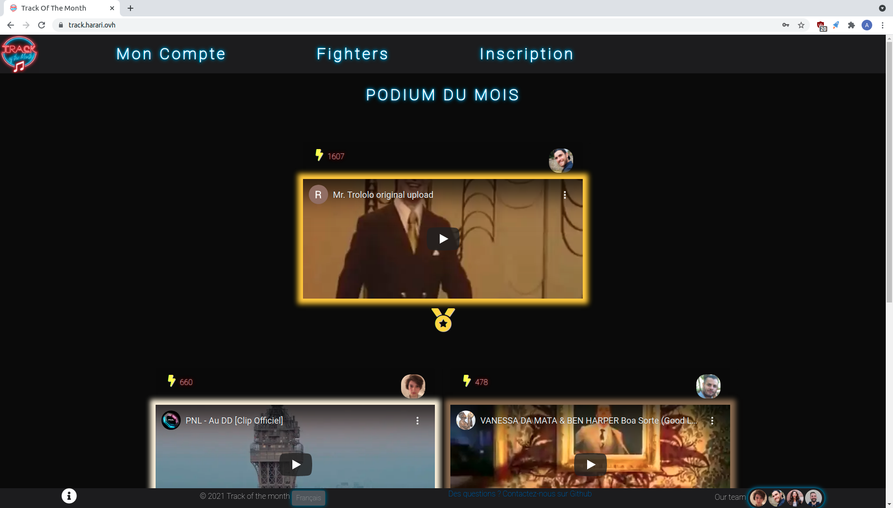

# Project2 - Track of the Month (base on a template simple MVC provide by the Wild Code School)

## Description

This repository is a simple PHP MVC structure from scratch.

It uses some cool vendors/libraries such as Twig and Grumphp.
For this one, just a simple example where users can choose one of their databases and see tables in it.

## Steps

1. Clone the repo from Github.
2. Run `composer install`.
3. Create *config/db.php* from *config/db.php.dist* file and add your DB parameters. Don't delete the *.dist* file, it must be kept.
```php
define('APP_DB_HOST', 'your_db_host');
define('APP_DB_NAME', 'your_db_name');
define('APP_DB_USER', 'your_db_user_wich_is_not_root');
define('APP_DB_PWD', 'your_db_password');
```
4. Import `track.sql` in your SQL server
I have destroy data from the table "User", there is only one user in the table : login "admin" => password "admin"

6. Run the internal PHP webserver with `php -S localhost:8000 -t public/`. The option `-t` with `public` as parameter means your localhost will target the `/public` folder.
7. Go to `localhost:8000` with your favorite browser.

### Windows Users

If you develop on Windows, you should edit you git configuration to change your end of line rules with this command :

`git config --global core.autocrlf true`

## Purpose of the Application  
1. Create an account
2. Post music with the URL of Youtube
3. You can vote for the music you like with the lightning bolt
4. Finally you can obtain badges/medals according to the number of vote you have done or with the number of music you have added to the platform.


## ScreenShot  


